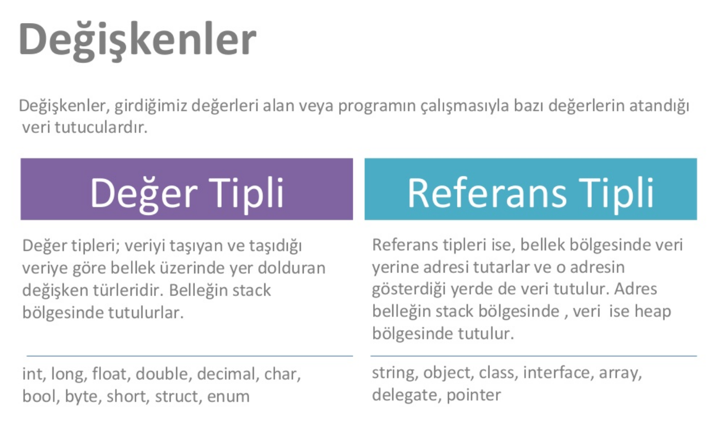
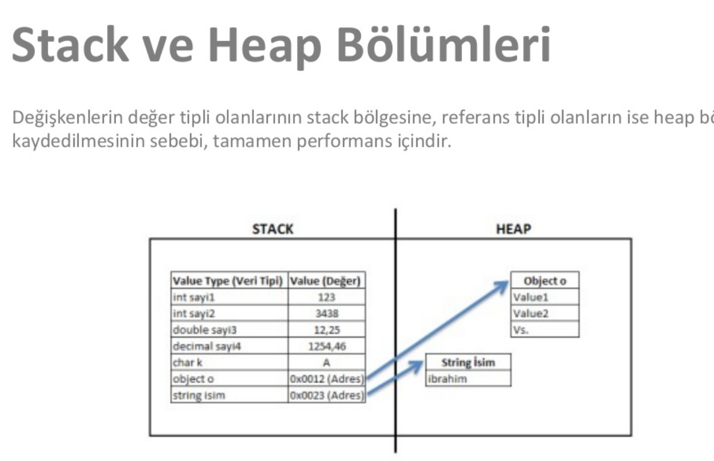

## DEĞİŞKENLER
- Herhangi bir girdinin ram üzerinde saklanmasını ve daha sonra kullanılmasını sağlar.
- Değişkenleri, veriyi belli bir isimle saklayan bir kutu olarak düşünebiliriz.
- Değişkenler C# ortamında türleri (veri tipleri) ile belirtilir.
    - Veri tipleri ve boyutları
- “Var” ile değişken tanımlama 
    - Var ifadesiyle değişken tanımlandığında ilk değerin girilmesi gereklidir, yoksa hata verecektir.
- “Object” ile değişken tanımlama
- “Dynamic” ile değişken tanımlama
    - Dynamic olarak tanımlanan bir değişkene, birden çok veri tipinde atama yapılabilir.
- Değişken tipleri
    - Değer tipi ve referans tipi değişkenler olmak üzere ikiye ayrılır.
    - Değer tipi değişkenler bellekte Stack adı verilen alanlarda saklanırken, referans tipli değişkenler ise Heap adı verilen alanlarda saklanır.
    - Stack içinde saklanan verinin boyutu bilinmelidir. Bu yüzden boyutu belli olan değişkenler burada saklanır ve erişimi daha hızlıdır.
    - Heap içinde saklanan verinin boyutu ise dinamik olarak belirlenip, çalışma zamanında kullanıma göre oluşturulur. Erişim olarak daha yavaştır. 
    - Heap içinde saklanan verinin referans adresi Stack içinde saklanır. Önce stack üzerinden ilgili heap adresinin neresi olduğu bulunur, daha sonra bu adresteki veri çekilir.
    - Heap bölgesinde daha büyük boyutlu veriler saklanabilir.
    - Stack içindeki saklanan değişkenlerin kullanımı bittikten sonra otomatik olarak bellekten düşer. Heap içindeki değişkenlerin kullanımı bittikten sonra Garbage Collector yardımıyla bellekten düşümü sağlanır.

<p align="center">
    
    
</p>

- Atama operatrörü kavramı ve atama yönü
    - “=” ifadesiyle “==” ifadesi aynı değildir!
- Değişken isimlendirme kuralları :
    - Sayı ile başlayamaz.
    Değişkenler isimlendirilirken kelimeler arasında boşluk karakteri kullanılmaz. Gerekli durumlarda _ ile kelimeler birleştirilebilir.
    - C#’da değişken isimleri büyük-küçük harf duyarlıdır. Yani sayi ile SAYI aynı değişkeni göstermez.
    - Değişken isimlerinde zorunluluk olmamasına karşın Türkçe karakter kullanılmamalıdır.
    - Değişken isimleri ?,!,:,% gibi özel karakterler içeremez.
    - Değişken ismi olarak C# dilindeki özel kelimeler seçilemez.
    - Değişken isimlerinde zorunlu olmamasına karşın küçük harf kullanımı tercih edilir. Eğer değişken ismi iki ya da daha fazla kelimeden oluşuyorsa ilk kelime hariç diğer kelimelerin ilk harfi büyük yazılır. (sayi, maasMiktari, kitapSayisi v.b.) 
- İki tane aynı isimli değişken olurştururken hata verir.
- Daha önce oluşturulan değişkenin değeri, yeni bir atama ile değiştirilebilir. 
- Bir değişkeninin değerini başka bir değişkene atama 
- Başlangıç değeri almadan değişken tanımlama
- Sabit değişkenler
    - “const” ön eki ile kullanılır.
    - Oluşturulduktan sonra değiştirilmeye çalışılırsa hata verir. 
- Null Kavramı
    - Null tipi ve null ile boşluk arasındaki fark
    - Nullable ve unnullable veri tipleri
- Tanımlandıkları yerlere göre değişkenler
    - Global değişkenler
        - Kullanıldıkları zaman public static ile birlikte kullanma
    - Local değişkenler
- GetType ve TypeOf metodları

```cs
var deger = 10;
if(deger.GetType() == typeof(int))
    Console.WriteLine("Değer bir sayıdır");
else
    Console.WriteLine(deger.GetType().ToString());
Console.ReadKey();
```

### Enumeration ( Numaralandırıcılar )

- Program içinde kullanılan sabitlerin anlamdırılması amacıyla sabitlere isimler verilerek bir grup (enum) altında toplayabiliriz.
- Sabitlerin isimlerinin, değişken isimlendirme kurallarına uyması gerekmektedir.
- Enum ifadeleri daha çok fonksiyonlar oluşturulurken verilen bir parametrenin sınırlandırılması için kullanılır. 

```cs
static void Main(string[] args)
{
    // Enum içindeki değerlere ulaşım
    Console.WriteLine((Gunler)0);
    Console.WriteLine(Gunler.cuma);

    // Enum içinde sabit kontrolü
    if (Enum.IsDefined(typeof(Gunler), "pazartesi"))
        Console.WriteLine("Değer var");
}

enum Gunler
{
    pazartesi = 1,
    sali = 0,
    carsamba = 2,
    persembe,
    cuma,
    cumartesi,
    pazar
}
```