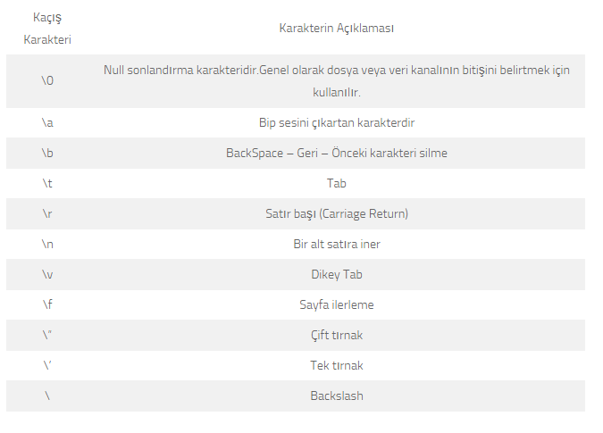

## KONSOL EKRANI VE KOD YAZMAYA GİRİŞ
- Write ve WriteLine komutları
- Bu metodların içinde kullanılan stringlerde “yer tutucular” kullanılabilir. Böylece bi string içine dışarıdan sırayla bazı değişkenler getirilerek okuma sağlanabilir. 

```cs
int sayi1 = 10;
int sayi2 = 20;

Console.WriteLine("Bellekteki sayılar {0} ve {1}'dir.", sayi1, sayi2);
```

- Yer tutucu ile yazılan yazıların sütunlar halinde yazılması isteniyorsa, yer tutucunun ikinci parametresi verilebilir.
    - Parametre değeri toplam kaç karakter yer kaplanacağını gösterir.
    - Yer tutucu yerine gelecek değer belirtilen karakterden fazla ise yine de kesilmeden yazılır.
    - Bu parametreler pozitif ise sağa dayalı, negatif ise sola dayalı olarak yazdırılır. 

```cs
int sayi1 = 10;
int sayi2 = 20;

Console.WriteLine("Bellekteki sayılar {0,-10} ve {1,10}'dir.", sayi1, sayi2);
```

- C# kaçış karakterleri

<p align="center">
    
</p>

- Read ve ReadLine komutları
    - Read metodu int, ReadLine komutu string okuma yapmak için kullanılır.
    - Read metodu kullanıldığında girilen ilk karakterin ASCII karakter kodunu geriye döndürür. 
- ReadKey komutu 
- Console.Clear() komutu
- Konsol rengi değiştirme:
    - BackgroundColor : Arkaplan rengini değiştirir.
    - ForegroundColor : Yazı rengini değiştirir.
    - ResetColor : Renk düzenini eski haline getirir.
    - Not : Renk değişikliklerinin tüm konsol üzerinde etkin olması isteniyorsa, renk değişiminden sonra Console.Clear() kullanılmalıdır. Aksi halde sadece ilgili satırların rengi değişecektir. 

```cs
Console.BackgroundColor = ConsoleColor.DarkBlue;
Console.ForegroundColor = ConsoleColor.White;
Console.Clear();
Console.ResetColor();
```

- ConsoleKeyInfo yapısı :
    - Ekran üzerinde basılan tüm tuşları algılayan metottur. Read() yapısından farklı olarak okunan karakteri ASCII yapısında değil, direk tuş yapısı olarak algılar. 

```cs
do
{
    Console.WriteLine("Çıkmak için ESC, bilgiyi yazdırmak için F2 tuşuna basınız.");

    ConsoleKeyInfo info = Console.ReadKey(true);

    if (info.Key == ConsoleKey.F2)
        Console.WriteLine("Bilgi");
    else if (info.Key == ConsoleKey.Escape)
        Environment.Exit(0);
    else
        Console.WriteLine(info.Key.ToString() + " tuşuna bastınız.");

} while (true);
```

- Environment.Exit(0) komutu