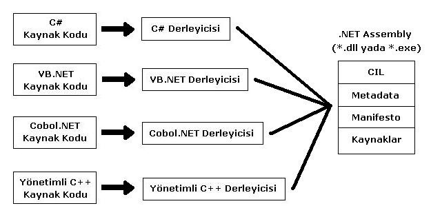
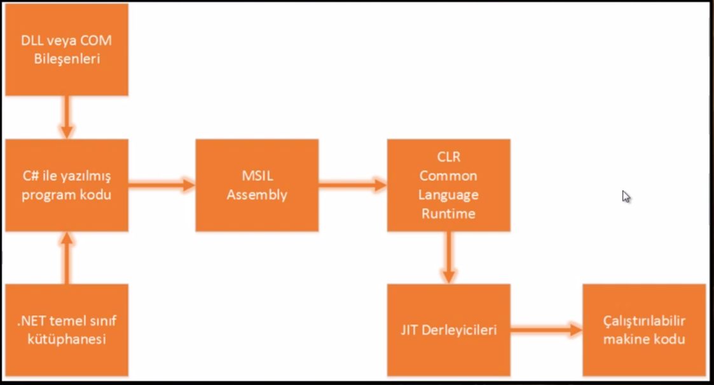

# C# ve .NET’E GİRİŞ

## 01 – MSIL (Mic. Intermediate Language) veya CIL (Common Intermadiate Language)

- Eski yapılarda, dillerle yazılan kodlar derlendiği zaman direk olarak makine diline ( Assembly) çevrilirdi.
- .NET platformuyla birlikte, diller artık direk makine diline değil, CIL denen ortak bir dile çevrilmeye başlandı.
- .NET platformu üzerindeki dillerle yazılan tüm kodlar bu dile çevrilir.
    - .dll ve .exe dosyaları assembly olarak adlandırılır.
    - Bu assembly ile makine dili olan assembly kavramları birbirinden farklıdır, sadece isim benzerliği vardır.
    - Assembly dosyaları CIL, Metadata, Manifesto içerir.
    - .dll ve .exe arasındaki fark:
        - Çalıştırılabilir assembly (.exe) program için ana giriş noktası (Main metodu) içerirken, kütüphane assembly’si (.dll) bunu içermez.
    - Metadata :
        - Assembly dosyasının içindeki üyelerin listesi ve bilgileri. Örneğin X adında bir sınıf varsa, tip metadası X sınıfının türediği sınıf, varsa hangi arayüzleri uyguladığı gibi ayrıntıları taşırken, X tipinin metotları, alanları vb. her bir üyesinin tüm tanımlamalarını içerir.
    - Manifesto :
        - Assembly dosyasının kendini tanımlayan bölümdür. Assembly adı, versiyonu,kültür bilgisi, kısa bir açıklama, başka assembly’lere olan referanslar gibi bilgilerin tamamına assembly metadata denir ve manifesto adıyla assembly içerisinde yer alır.
- Bu dile derlenen kodlar CLR ve JIT derleyicileri ile platform üzeinde çalıştırılır.
- Bu yöntemin avantajı
    - Yazılan kodlar direk makine diline çevrilmediğinden, kodlar platform bağımsız olarak derlenebilmektedir.
    - İlgili platformun CLR ve JIT derleyicileriyle bu kodlar tüm platformlarda çalıştırılabilir.
    - Farklı dillerle yazılmış kodlar, birbirine referans olarak verilebilir ve kütüphane olarak kullanılabilir.

## 02 – CLR – Common Language Runtime Nedir?
- Ortak dil çalışma zamanı
- .NET platformunun bir alt yapısı olarak karşımıza çıkar.
- CLR, MSIL kodlarını ilgili platformda çalıştırmaya yarar. Her platform için geliştirilebileceği için, platform bağımsız kod yazmaya olanak tanır.

## 03 – JIT ( Just In Time ) Compiler
- CLR ile birlikte MSIL Assebly kodlarının platformda çalışmasını sağlarlar.
- Her platforma özel olarak üretilmesi gereklidir. 
- 3 çeşidi vardır : 
    - Normal JIT
        - Programı derledikten sonra ön bellekte tutarak, programın ram üzerinden çalıştırılmasını sağlar ve durmadan derlenmesinin önüne geçer.
    - Eco JIT
        - Hafızası az olan cihazlar için kullanılır. Ram üzerinde az yer tutar ve kullanılmayan verilerin silinmesini sağlar.
    - Pre JIT
        - Büyük programlar içindir ve ön derleme yaparak perfonmasın arttırılmasını sağlar.

## 04 – VS İndirme ve VS Ortamı
- İndirme :
    - https://www.visualstudio.com/tr/downloads/
- Pencere:
    - Solution Explorer
    - Team Fondution Server
    - Error List
    - Properties Window
    - ToolBox
    - Output
    - TaskList

## 05 – Console Application Nedir?
- Basit bir console app oluşturma
- Solution ve Project kavramları
- Bir solition içine birden fazla solution ekleme
- Kodları yazma 
    - Satır satır okuma
    - Süslü parantezler ve noktalı virgül
    - Projeyi başlatma ve durdurma
    - Debug ve Release kavramları
    - Debugging kavramları ve breakpoint
